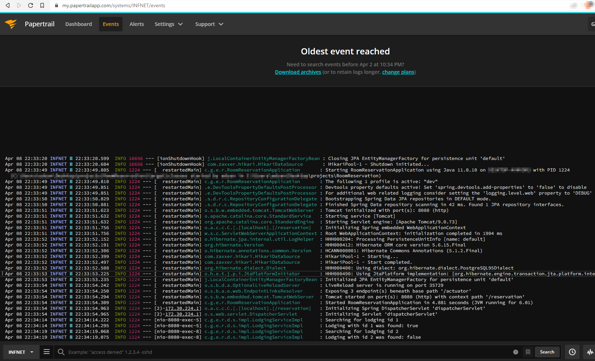
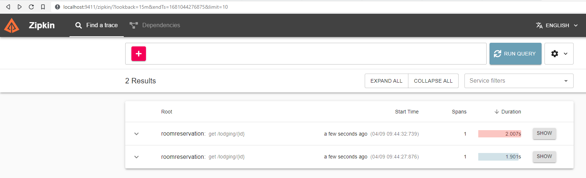
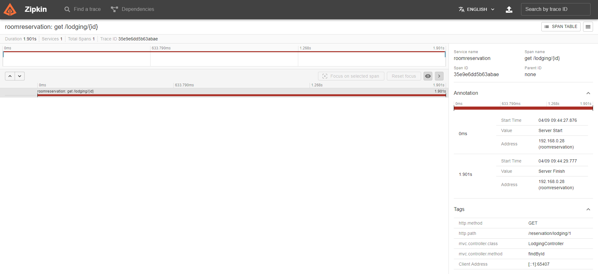
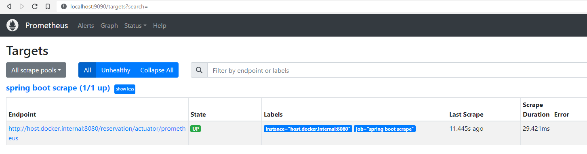

# RoomReservation
spring boot and devops project

# Run
- install docker
- git clone https://github.com/edsandrof/RoomReservation.git
- cd RoomReservation
- docker compose up -d
- make GET request http://localhost:8080/reservation/lodging/1

# Endpoints
## actuator 

health check: http://localhost:8080/reservation/actuator/health

prometheus: http://localhost:8080/reservation/actuator/prometheus

## prometheus

http://localhost:9090/targets

## zipkin

http://localhost:9411/zipkin

# terraform
- download terraform binary:
  https://developer.hashicorp.com/terraform/downloads
- put binary file in your path
- access the terraform directory in this project and type:
  - terraform init
  - terraform apply -auto-approve
  - terraform output
  - terraform destroy

# Screenshots
Papertrail

Zipkin

Prometheus

# Info
- java 11 with spring boot
- micrometer and prometheus
- zipkin
- papertrail
- postgres db
- docker
- tdd

